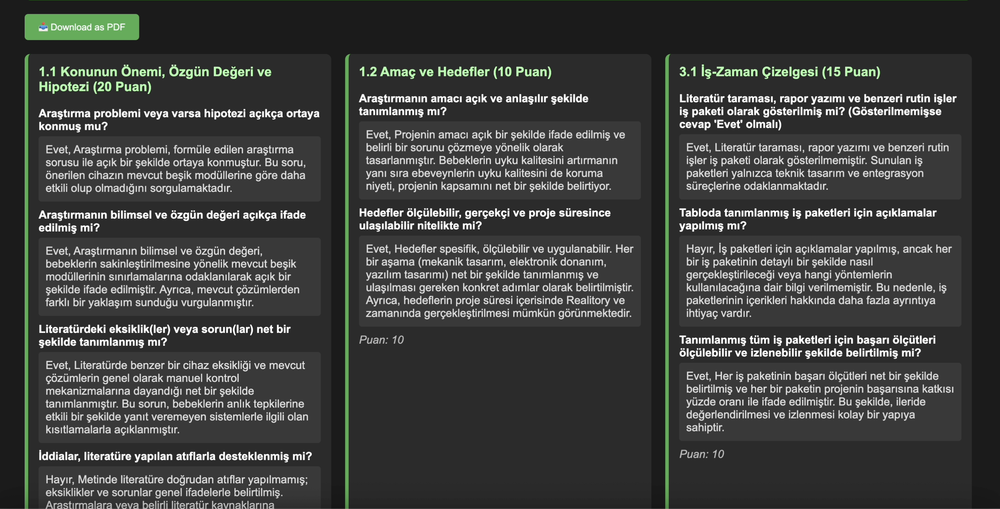

# Project Proposal Evaluation and Analysis System

An AI-powered web platform for automated evaluation of TÜBİTAK 2209-A project proposals using Natural Language Processing, Retrieval-Augmented Generation (RAG), and modern web technologies.

## 🎯 Project Overview

This system revolutionizes the project proposal evaluation process by combining advanced AI technologies to provide automated, consistent, and objective assessment of research proposals. Developed as a graduation thesis project, it addresses the challenges of manual evaluation through intelligent document analysis and contextual question-answering capabilities.

### Key Features
- **Automated Evaluation**: AI-driven assessment using predefined rubrics with detailed scoring
- **RAG-based Q&A**: Intelligent question-answering system with Turkish BERT embeddings
- **Document Processing**: Advanced DOCX parsing with hierarchical content extraction
- **Real-time Analysis**: Instant feedback and comprehensive evaluation reports
- **User Management**: Firebase authentication with evaluation history tracking

## 🏗️ System Architecture


The system implements a dual-pathway architecture:

### Option 1: Report Generation Pipeline
- **Document Extraction**: DOCX file parsing and content structuring
- **Evaluation Module**: Rubric-based assessment using LLM
- **Report Generation**: PDF output with detailed scoring and feedback

### Option 2: RAG-powered Q&A System
- **Content Embedding**: Turkish BERT model for semantic representation
- **Vector Search**: Cosine similarity for relevant context retrieval
- **Contextual Response**: LLM-generated answers based on document content

## 🛠️ Technology Stack

### Backend
- **Python Flask**: RESTful API development and server-side logic
- **OpenAI API**: Advanced language model integration for evaluation
- **Turkish BERT**: "emrecan/bert-base-turkish-cased-mean-nli-stsb-tr" for embeddings
- **python-docx**: Document parsing and content extraction
- **Firebase**: Authentication and data persistence

### Frontend
- **React/HTML**: Responsive user interface design
- **Real-time Processing**: Live feedback during evaluation
- **PDF Generation**: Downloadable comprehensive reports

### AI/ML Components
- **Natural Language Processing**: Advanced text analysis and understanding
- **Retrieval-Augmented Generation**: Custom RAG implementation for Turkish content
- **Vector Similarity Search**: Efficient content matching and retrieval
- **Semantic Embeddings**: Context-aware document representation

## 📱 User Interface

### Evaluation Results




### Q&A Result


## 🚀 Core Functionalities

### 1. Automated Proposal Evaluation
- Upload DOCX project proposals
- Structured content extraction and analysis
- Rubric-based scoring across multiple criteria
- Detailed feedback generation with improvement suggestions
- PDF report export with comprehensive analysis

### 2. Intelligent Q&A System
- Natural language query processing
- Context-aware response generation
- Semantic search through proposal content
- Real-time interaction with document data

### 3. Document Processing Pipeline
- Advanced DOCX parsing with section recognition
- Hierarchical JSON representation of proposals
- Content chunking for efficient embedding
- Metadata extraction and organization

## 🔧 Technical Implementation

### RAG Architecture
```python
# Custom RAG implementation workflow:
1. Document chunking and preprocessing
2. Turkish BERT embedding generation
3. Vector database creation and indexing
4. Query embedding and similarity search
5. Context retrieval and LLM integration
6. Response generation with source attribution
```

### Evaluation Pipeline
- Multi-criteria assessment framework
- Weighted scoring system based on TÜBİTAK guidelines
- Consistency validation across evaluations
- Detailed rubric alignment and feedback generation

## 📊 Key Benefits

### For Evaluators
- **Efficiency**: Automated assessment reducing evaluation time by 70%
- **Consistency**: Standardized criteria application across all proposals
- **Objectivity**: Elimination of human bias in initial screening
- **Scalability**: Ability to process multiple proposals simultaneously

### For Researchers
- **Instant Feedback**: Real-time evaluation results and suggestions
- **Detailed Analysis**: Comprehensive breakdown of proposal strengths/weaknesses
- **Interactive Support**: Q&A system for proposal clarification
- **Historical Tracking**: Access to previous evaluations and improvements

## 🎓 Academic Contribution

This project represents a significant advancement in automated document evaluation, specifically addressing:
- **Turkish NLP**: Implementation of Turkish language models for academic content
- **RAG Optimization**: Custom retrieval system for domain-specific documents
- **Evaluation Standardization**: Consistent application of academic assessment criteria
- **Research Efficiency**: Streamlined proposal review process for funding organizations

## 🏆 Technical Achievements

- **Custom RAG Implementation**: Built from scratch without using existing frameworks
- **Turkish Language Support**: Specialized embedding model for Turkish academic content
- **Multi-modal Processing**: Integration of document structure and semantic content
- **Scalable Architecture**: Designed for high-throughput proposal processing
- **Real-time Performance**: Optimized for immediate user feedback

**Project Type**: Graduation Thesis / TÜBİTAK 2209-A Research  
**Keywords**: NLP, RAG, Turkish BERT, Document Analysis, AI Evaluation  
**Skills Demonstrated**: AI/ML Development, NLP, RAG Implementation, Full-Stack Development, Research Innovation